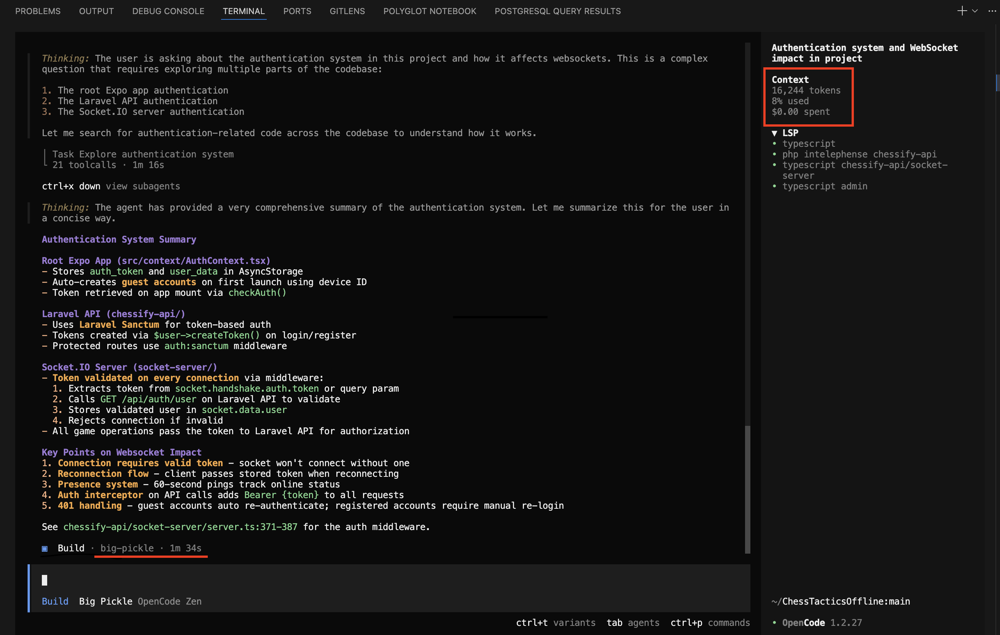
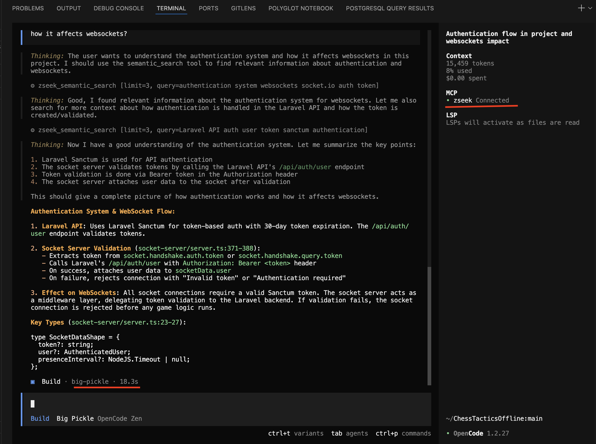

<div align="center">
  
  
  <h1>🚀 Z-Seek</h1>
  
  <p><strong>A blistering fast, local Model Context Protocol (MCP) server that provides semantic search capabilities over your codebase.</strong></p>

  <p>
    <a href="https://github.com/zerakjamil/z-seeker/blob/main/LICENSE"></a>
    <a href="https://rust-lang.org"></a>
    <a href="https://modelcontextprotocol.io/"></a>
  </p>
</div>

<br/>

It actively watches your workspace files, parses them using `tree-sitter`, generates embeddings via the **GitHub Copilot API**, and indexes them in a local **LanceDB** vector database. By exposing a standard MCP `"semantic_search"` tool, it allows any compatible LLM client to mathematically search and understand your local code architecture.

## ✨ Features

### Side-by-side Comparison

See the difference in context awareness when giving an AI standard file access vs enabling semantic reasoning powered by `z-seek`:

<table>
  <tr>
    <th width="50%">Before Z-Seek (No Context)</th>
    <th width="50%">After Z-Seek (Semantic Search via MCP)</th>
  </tr>
  <tr>
    <td></td>
    <td></td>
  </tr>
</table>

- **Real-Time Indexing**: Runs a background `tokio` watcher that automatically detects file changes and re-indexes code chunks on the fly.
- **AST-Aware Chunking**: Leverages `tree-sitter` (Rust, TypeScript/JavaScript) to smartly chunk your code by logical blocks rather than arbitrary line breaks.
- **Local Vector Database**: Uses `LanceDB` directly on your disk (`.lancedb/`) for sub-millisecond similarity search—no external database setup required.
- **MCP Compliant**: Communicates via standard STDIO JSON-RPC. Easily pluggable into Copilot, Cursor, Claude Desktop, and other MCP-compatible clients.

## Token Efficiency & Usage Rates

Z-Seek is designed to be **hyper-efficient** with your GitHub Copilot quota:
- **No Chat Overload**: Z-Seek uses AST-aware parsing (`tree-sitter`) to return *only* the specific structs and functions relevant to your query.
- **Cheap Embeddings**: Indexing your files relies on the `embeddings` endpoint, which is orders of magnitude faster and cheaper than standard chat token generation. Once a file is indexed, it is cached locally in LanceDB. Z-Seek only reaches out for a new embedding if you **save** an active modification to a file. 
- **Zero-Waste Queries**: When you ask a question, Z-Seek only performs inference on your 1-sentence question to match it against your local database!

---

## 📦 Prerequisites

- **Rust** (Edition 2021) and `cargo`. [Install Rust](https://www.rust-lang.org/tools/install)
- A **GitHub Copilot API Key** (for fetching embeddings).

## 🛠️ Installation & Setup

1. **Clone the repository:**
   ```bash
   git clone https://github.com/zerakjamil/z-seeker.git
   cd z-seeker
   ```

2. **Build the Project:**
   ```bash
   cargo build --release
   ```

3. **Authenticate:**
   You must authorize the app securely with your GitHub account so it can fetch embeddings.
   ```bash
   ./target/release/z-seeker auth
   ```
   Follow the on-screen instructions to paste your code at `https://github.com/login/device`. Your token will be securely saved to `~/.copilot-mcp-token`.

## ⌨️ CLI Usage

Z-Seek comes with a built-in CLI to manually manage background syncing and index configuration. It functions seamlessly as your personal, unlimited semantic grep tool.

Install it globally using `cargo install`:

```bash
cargo install --path .
```

Then you can use the `zseek` command anywhere:

```bash
# Start the MCP server (Default behavior)
zseek

# Authenticate with GitHub Copilot
zseek auth

# Index the current repository and keep the local LanceDB store in sync via file watchers
zseek watch

# Limit uploads/indexing to files under a specific size (in bytes, default is 5MB)
zseek watch --max-file-size 5242880

# Limit the indexing to a specific number of files (default is 2000) to prevent exhausting embeddings
zseek watch --max-file-count 2000

# Self-update to the newest zseek version from GitHub
zseek self-update

# Alias for self-update
zseek selfupdate
```

### Custom Ignore Rules (`.zseekignore`)

Z-Seek now supports a per-workspace ignore file named `.zseekignore`.
If this file exists in an active workspace root, its patterns are applied during initial indexing and live watcher updates.

Pattern syntax follows gitignore-style rules, for example:

```gitignore
# Skip generated clients
*.generated.ts

# Skip runtime artifacts
logs/**
.expo/**
.next/**
storage/framework/**
```

This is additive to Z-Seek's built-in skip list (`node_modules`, `.venv`, `.next`, `.expo`, lockfiles, `.log`, etc.).

## 🔌 Hooking it up to an MCP Client

Because this server implements the Model Context Protocol over standard input/output (STDIO), you can configure your AI assistant to spawn it as a child process.

### Option A: VS Code (GitHub Copilot)
If you are using GitHub Copilot inside VS Code, you can dramatically simplify installation by running the automatic installer hook:

```bash
zseek install
```

This will automatically find your VS Code `settings.json` and map the Z-Seek executable into your MCP ecosystem.

Alternatively, you can add it manually mapping this into your VS Code Settings (JSON):

```json
{
  "github.copilot.chat.mcp.servers": {
    "Z-Seeker Search": {
      "command": "zseek",
      "args": []
    }
  }
}
```
3. Open GitHub Copilot chat and ask: *"Select the local-semantic-search tool and find where tree-sitter chunking is handled."*

### Option B: Claude Desktop / Cursor Config
Add the following to your MCP client's configuration file (e.g., `claude_desktop_config.json`):

```json
{
  "mcpServers": {
    "local-semantic-search": {
      "command": "/absolute/path/to/z-seeker/target/release/z-seeker",
      "args": []
    }
  }
}
```

Once hooked up, simply ask your AI: *"Use semantic search to find where the database authentication logic is handled."*

---

## 🏗️ Architecture Overview

The system is broken down into 5 heavily optimized modules:

1. **`watcher.rs`**: Asynchronous filesystem watcher utilizing `mpsc` channels to debounce and stream file modification events.
2. **`parser.rs`**: Implements `tree-sitter` bindings to extract meaningful syntax nodes (skipping tiny fragments) to ensure high-quality contextual chunks.
3. **`provider.rs`**: Handles remote network inference to generate `1536`-dimensional `Float32` float arrays (compatible with `text-embedding-3-small`).
4. **`db.rs`**: Bridges perfectly typed Apache `arrow-array` structures into an embedded LanceDB table. Resolves Euclidean/Cosine distance against code vectors.
5. **`mcp.rs`**: The JSON-RPC STDIO router that maps the LLM's `tools/call` parameters directly into database vector queries.

## ⚡ Performance on Low-End Hardware

This project was built from the ground up in Rust specifically to run entirely in the background without draining system resources. It is highly optimized for developers on restricted hardware (e.g., 8GB RAM laptops, older CPUs).

- **RAM**: Expect less than `~40MB` of RAM overhead. LanceDB uses memory-mapped files via Apache Arrow, meaning the vector database doesn't need to load entirely into RAM to be queried.
- **CPU**: `0%` usage while idling. Code parsing and vector database insertions use `tokio` asynchronous threads to prevent blocking the main thread, resulting in tiny CPU bursts only when files are explicitly saved.
- **Offloaded AI**: Because this uses the GitHub Copilot Embedding API, you do NOT run a heavy neural network locally. The 1536-dimensional embeddings cost zero local CPU tensor operations to generate.

## 🤝 Contributing

Contributions are heavily encouraged! If you're adding support for new languages in the `tree-sitter` parser, optimizing the Arrow array memory layouts, or adding new embedding providers (like OpenAI or Local Ollama), please submit a Pull Request.

1. Fork the Project
2. Create your Feature Branch (`git checkout -b feature/AmazingFeature`)
3. Commit your Changes (`git commit -m 'Add some AmazingFeature'`)
4. Push to the Branch (`git push origin feature/AmazingFeature`)
5. Open a Pull Request

## 📄 License

Distributed under the MIT License. See `LICENSE` for more information.
